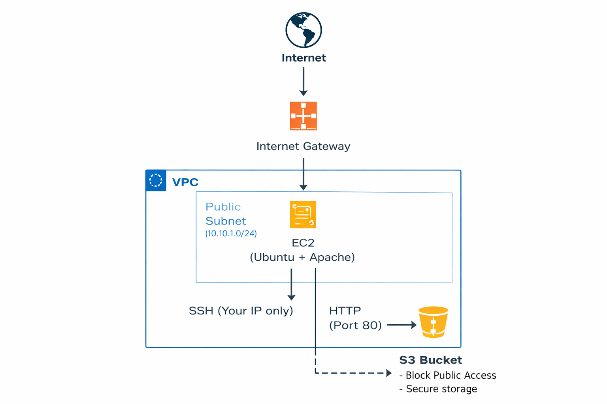
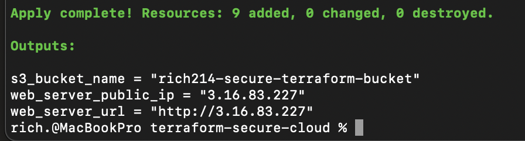
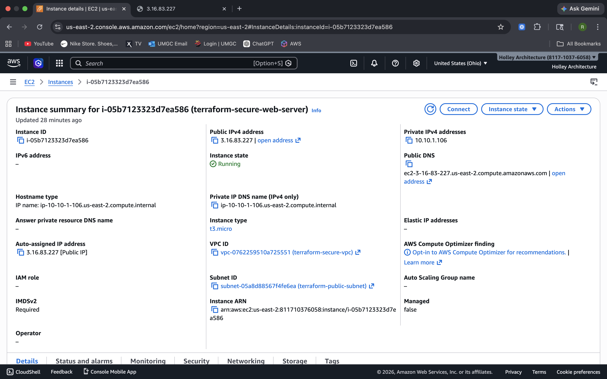
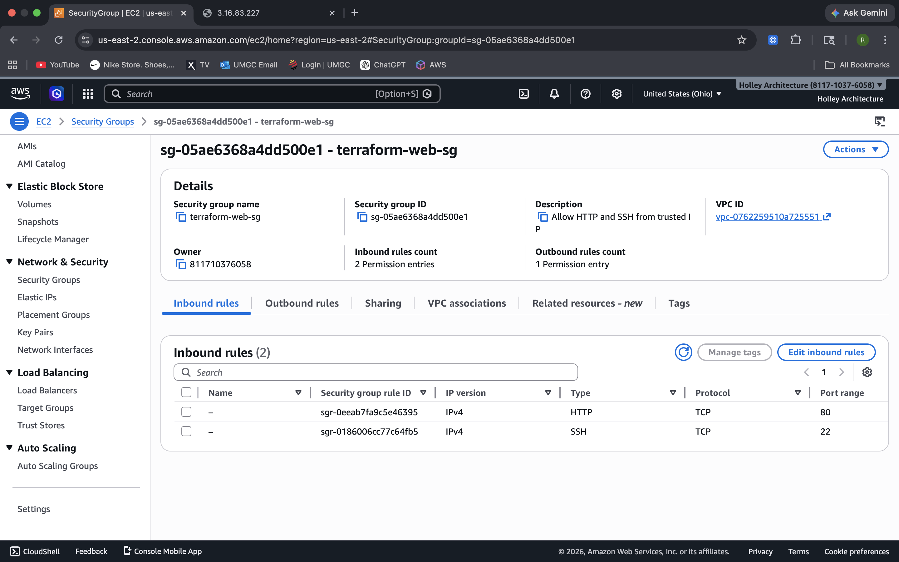
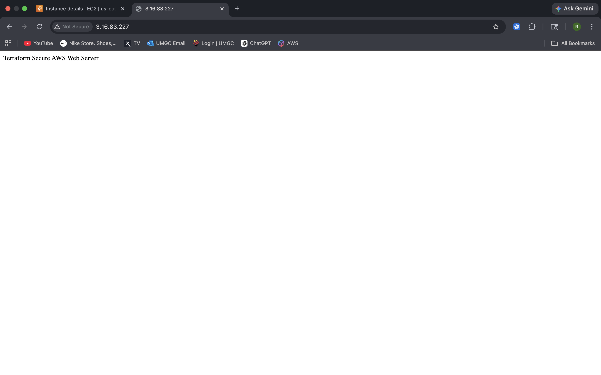
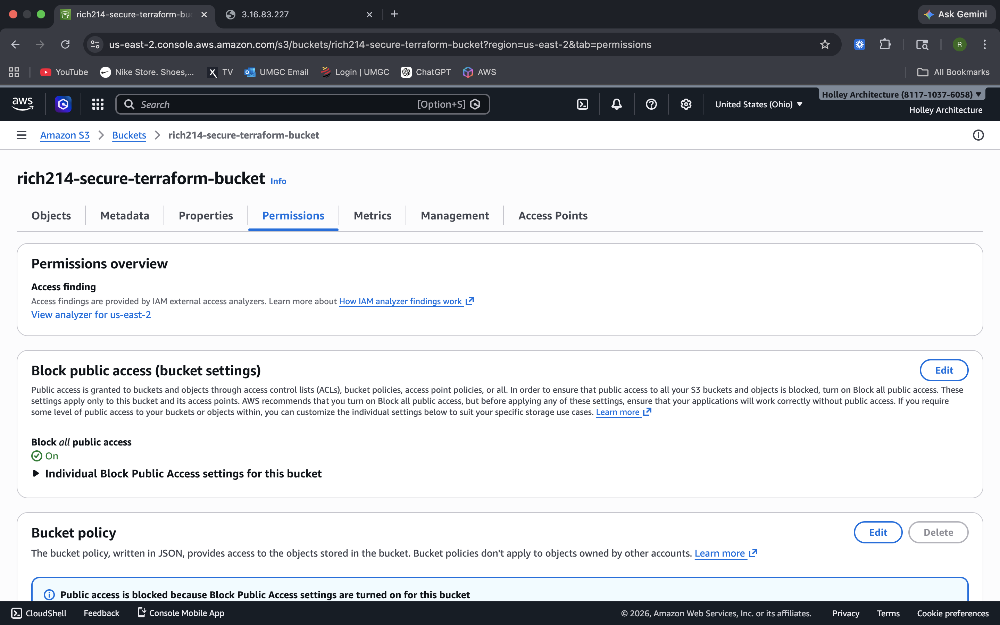

## Architecture Diagram



# AWS Secure Cloud Environment (Terraform)

This project demonstrates how to design, deploy, and secure AWS infrastructure using Terraform. It showcases a production-style cloud environment with networking, compute, and storage components built using Infrastructure as Code (IaC).

## Project Summary

In this project, I deployed a secure AWS environment using Terraform, including a custom VPC, EC2 web server, and S3 storage. The focus was on implementing security best practices, automating infrastructure, and troubleshooting real-world cloud deployment issues.

## Architecture Overview

The environment consists of:

- Custom Virtual Private Cloud (VPC)
- Public subnet with internet access
- Internet Gateway for external connectivity
- Route table configured for outbound traffic
- Security group with controlled access rules
- EC2 Ubuntu instance hosting a web server
- S3 bucket with public access blocked

## Security Implementation

- Restricted SSH access using CIDR-based IP filtering
- Allowed HTTP (port 80) for controlled web access
- Enforced S3 Block Public Access settings
- Applied least-exposure principles in security group rules

## Technologies Used

- AWS (EC2, VPC, S3, Security Groups)
- Terraform
- Linux (Ubuntu)
- Apache Web Server

## Project Evidence

### Terraform Apply (Successful Deployment)


### EC2 Instance Running


### Security Group Configuration


### Web Server Verification


### S3 Bucket Security


## Challenges & Solutions

During the deployment, I encountered and resolved several real-world issues:

- **IAM Permission Errors**
  - Terraform initially failed due to insufficient permissions
  - Resolved by using a properly privileged IAM user

- **S3 Bucket Naming Conflict**
  - Bucket names must be globally unique
  - Adjusted naming to resolve conflict

- **Operating System Mismatch**
  - Initial script used Amazon Linux commands (`dnf`, `httpd`)
  - Instance used Ubuntu, requiring:
    - `apt` instead of `dnf`
    - `apache2` instead of `httpd`

- **SSH Connectivity Issues**
  - Resolved key permissions and correct username (`ubuntu`)

## Key Skills Demonstrated

- Infrastructure as Code (Terraform)
- AWS networking (VPC, subnets, routing)
- Cloud security configuration
- EC2 deployment and configuration
- S3 security best practices
- Linux system administration
- Cloud troubleshooting and debugging

## Resume-Ready Summary

Deployed AWS infrastructure using Terraform, including a custom VPC, subnet, internet gateway, security group, EC2 web server, and secure S3 bucket, while troubleshooting IAM permissions, SSH access, and OS-specific configuration issues.

## How to Run

1. Copy `terraform.tfvars.example` to `terraform.tfvars`
2. Update the values for region, AMI, key pair, bucket name, and IP
3. Run `terraform init`
4. Run `terraform plan`
5. Run `terraform apply`
6. Access the EC2 public IP in a browser
7. Run `terraform destroy` when finished

```markdown
## Cleanup

To remove all resources and avoid AWS charges:

```bash
terraform destroy
```
## Why This Project Matters

This project demonstrates real-world cloud engineering skills, including:

- Infrastructure as Code (Terraform)
- Secure network design (VPC, subnets, routing)
- Access control and least privilege principles
- Web server deployment and validation
- Troubleshooting cloud deployment issues

These are directly applicable to roles such as Cloud Engineer, DevOps Engineer, and Cybersecurity Analyst.

## Resume Highlights

- Built and deployed AWS infrastructure using Terraform (IaC)
- Designed secure VPC architecture with public subnet and routing
- Configured EC2 web server with Apache and public access validation
- Implemented security group rules restricting SSH access to a specific IP
- Secured S3 bucket using block public access settings
- Demonstrated full deployment lifecycle: plan → apply → validate → destroy
